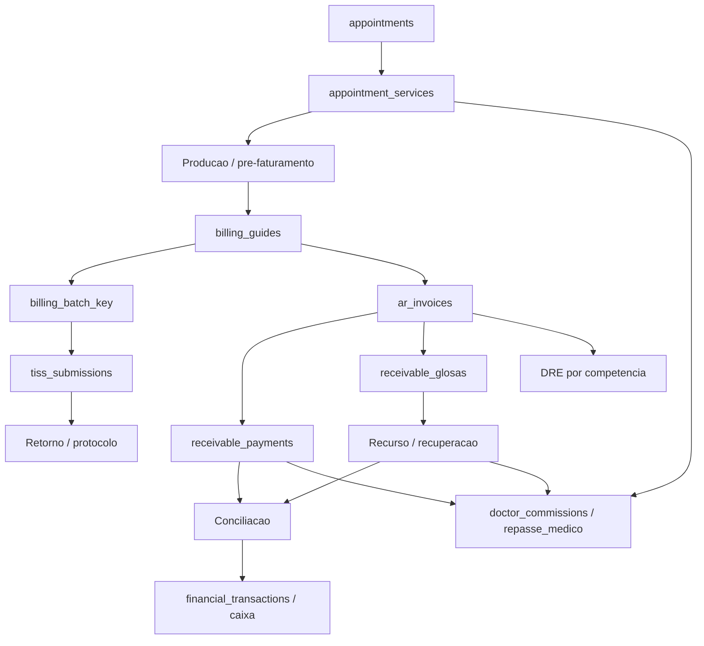

# Faturamento de Convenios - Auditoria e Mapa Tecnico

Data da revisao: 2026-10-06

## 1. Resumo executivo

O Gesclinic possui a cadeia principal Agenda -> producao -> guia -> recebivel -> pagamento/glosa -> Financeiro -> repasse, mas ainda nao implementa integralmente o escopo mestre.

Classificacao atual:

- Implementado: Agenda e `appointment_services`, guias TISS, recebiveis em `ar_invoices`, pagamentos, glosas, workflow de recurso, integracao com Fluxo/DRE, repasses, dashboard operacional e relatorios basicos.
- Parcial: pre-faturamento, lotes, XML e envio externo, protocolos, configuracao de convenios, conciliacao de pagamentos de operadoras, auditoria de todas as transicoes, RBAC granular e central de pendencias.
- Ausente ou nao homologado: calendario operacional, entidade completa de lote, documentos obrigatorios por convenio, importador multi-layout de demonstrativos, matching especifico guia/procedimento, estorno integrado de toda a cadeia, PDF de todos os relatorios e homologacao real com operadoras.

Principio adotado: nao criar motores financeiros paralelos. `appointment_services` e a origem dos itens; `billing_guides` representa a guia; `ar_invoices` e o recebivel canonico; pagamentos e glosas sao eventos vinculados; repasses derivam da mesma origem.

## 2. Cadeia transacional canonica

Chaves obrigatorias em toda a trilha:

- `clinic_id`
- `appointment_id`
- `professional_id`
- `patient_id`
- `payer_id` / `convenio_id`
- `service_id` / `procedure_id`
- `guide_number` e `metadata.guide_id`
- `billing_batch_key`
- `ar_invoice_id`
- competencia, data de faturamento e data efetiva de caixa separadas

## 3. Matriz do escopo mestre

| Dominio | Estado | Implementacao atual | Lacuna principal |
| --- | --- | --- | --- |
| Agenda e producao | Implementado | `faturamento360Api.js`, `appointmentBillingApi.js`, `appointment_services` | Consolidar todos os caminhos de finalizacao no evento 360 |
| Pre-faturamento | Parcial | auditoria em `faturamentoOperationalApi.js` | Fila persistente, documentos, bloqueios e responsavel/prazo |
| Convenios e regras | Parcial | `health_insurances`, `appointment_payer_rules` | Tela ativa ainda convive com configuracoes mockadas/legadas |
| Calendario | Ausente | jobs agendados apenas | Datas de fechamento, envio, NF, pagamento e recurso por convenio |
| Guias | Implementado parcial | `billing_guides`, `GuiasPage.jsx` | Itens/anexos e status global mais granular |
| Lotes | Parcial | agrupamento de guias e `billing_batch_key` | Entidade completa, fechamento/reabertura e auditoria |
| XML TISS | Parcial | `tissApi.js`, `tissSubmissionServiceApi.js` | Homologacao, assinatura/certificado e imutabilidade de versoes |
| Envio/protocolo | Parcial | `tiss_submissions` | SFTP exige backend; protocolos reais dependem das operadoras |
| Retornos | Parcial | `RetornosPage.jsx`, `tiss_submissions` | Importadores XML/CSV/XLS/TXT por layout |
| Glosas | Implementado | `receivable_glosas`, workflow em `receivablesApi.js` | Regras automaticas sobre honorarios por motivo de glosa |
| Recursos | Parcial | contestacao e recuperacao em glosas | Documentos, protocolo e SLA operacional dedicado |
| Previsao | Implementado | `ar_invoices.due_date`, forecast operacional | Calendario contratual completo por convenio/lote |
| Conciliacao e baixa | Parcial | motores bancarios e `receivable_reconciliation` | Matching especifico de demonstrativo por lote/guia/procedimento |
| Pagamentos parciais | Implementado | `registerReceivablePayment()` | Validar layouts reais de operadoras |
| Complementares | Parcial | pagamentos adicionais e recuperacao | Automatizar honorario complementar ponta a ponta |
| Honorarios | Implementado parcial | RPC `gerar_repasse_medico`, APIs de repasse | Unificar modelos producao/recebimento/hibrido e efeito da glosa |
| Financeiro | Implementado | `ar_invoices`, Fluxo, DRE, plano e centro de custo | Garantir uma unica postagem idempotente por evento |
| Auditoria | Parcial | logs TISS e auditoria financeira | Cobrir lote, conciliacao, estorno e alteracao contratual |
| Permissoes | Parcial | RBAC por feature | Acoes criticas separadas por faturista/auditor/financeiro/honorarios |
| Relatorios | Parcial | CSV e paineis reais | PDF e relatorio completo de conciliacao/rastreabilidade |
| Importacao/migracao | Parcial | importadores financeiros dispersos | Pipeline unico simular -> validar -> confirmar -> auditar |

## 4. Objetos Supabase

### Reutilizar como fontes canonicas

- `appointments`: atendimento.
- `appointment_services`: itens realizados e base de producao/repasse.
- `billing_guides`: guia e status operacional.
- `tiss_submissions`: XML, envio, tentativa, protocolo e retorno.
- `ar_invoices`: previsao e titulo de Contas a Receber.
- `receivable_payments`: pagamentos imutaveis e complementares.
- `receivable_glosas`: glosa, contestacao e recuperacao.
- `financial_transactions`: movimentos previstos/realizados.
- `doctor_commissions` e `repasse_medico`: honorarios.
- `appointment_payer_rules`: regras por convenio.
- `tiss_audit_logs` e logs financeiros: trilha de auditoria.

### Evolucoes recomendadas

1. Evoluir `billing_batch_key` para entidade `billing_batches` somente quando fechamento, reabertura, versoes XML e responsavel exigirem transacao propria. Ate la, a chave deve ser persistente e imutavel nas guias.
2. Criar `billing_calendars` por clinica/convenio/competencia.
3. Criar `billing_documents` para anexos obrigatorios e validacao.
4. Consolidar importacoes de operadoras sobre `finance_payer_payment_imports`, linhas, matches e eventos append-only.
5. Criar tabela de pendencias operacionais ou materializar a fila a partir de eventos com SLA.

Toda tabela nova deve possuir `clinic_id`, RLS, indices de tenant/status/data, `created_at`, `updated_at` e autor da alteracao.

## 5. Status global canonico

Ordem operacional proposta:

`producao` -> `pendente` -> `conferida` -> `guia_gerada` -> `faturada` -> `lote_fechado` -> `xml_gerado` -> `enviado` -> `protocolado` -> `processado` -> `aguardando_pagamento` -> `pago_parcial` -> `pago` -> `glosado` -> `em_recurso` -> `recuperado` -> `conciliado` -> `baixado` -> `encerrado`.

Cancelamento, rejeicao, estorno e reversao sao eventos laterais; nao devem apagar o historico anterior.

## 6. APIs e ownership

- `faturamento360Api.js`: builder do evento faturavel originado na Agenda.
- `faturamentoOperationalApi.js`: workflow guia -> recebivel -> retorno/glosa/pagamento.
- `receivablesApi.js`: unica API de mutacao de `ar_invoices`, pagamentos e glosas.
- `faturamentoReportsApi.js`: consultas e agregacoes sem duplicar guia ja convertida em recebivel.
- `tissApi.js` / `tissSubmissionServiceApi.js`: validacao, XML e transporte TISS.
- APIs de repasse: calculo/liberacao; devem consumir IDs e valores preservados pelo evento faturavel.

Regra: paginas nao devem implementar calculo financeiro ou atualizar status critico diretamente no Supabase; devem chamar uma API de dominio idempotente.

## 7. Plano de implementacao

### P0 - Integridade transacional

- Preservar IDs Agenda -> guia -> recebivel -> repasse.
- Tornar `billing_batch_key` persistente e estavel.
- Eliminar dupla contagem guia/recebivel.
- Definir transicoes de status e eventos imutaveis.
- Testar idempotencia de recebivel, lote, pagamento e repasse.

### P1 - Operacao de faturamento

- Parametrizacao real de convenio e calendario.
- Pre-faturamento com documentos, autorizacao e SLA.
- Lote persistente com fechamento/reabertura auditada.
- XML versionado e bloqueado apos fechamento.

### P2 - Retorno e conciliacao

- Importadores por layout.
- Matching exato/provavel/manual por lote, guia, paciente, procedimento e valor.
- Separacao de glosa, retencao, imposto, desconto e complemento.
- Baixa/estorno append-only e saldo residual.

### P3 - Honorarios e gestao

- Regras producao/recebimento/hibrido.
- Efeito da glosa e honorario complementar.
- Dashboard completo, aging, alertas, relatorio de conciliacao e PDFs.

## 8. Criterios de producao

Uma fase somente esta pronta quando possui:

- filtro por `clinic_id` e RLS validada;
- operacao idempotente;
- auditoria com antes/depois e usuario;
- teste unitario do contrato e teste de integracao do fluxo;
- tratamento de parcial, complemento, estorno e concorrencia;
- build aprovado e smoke autenticado;
- migration aplicada e verificada no Supabase alvo.

Dependencias externas ainda bloqueantes: credenciais/endpoints reais das operadoras, certificado/assinatura TISS, backend para SFTP e ambientes separados de homologacao/producao.
